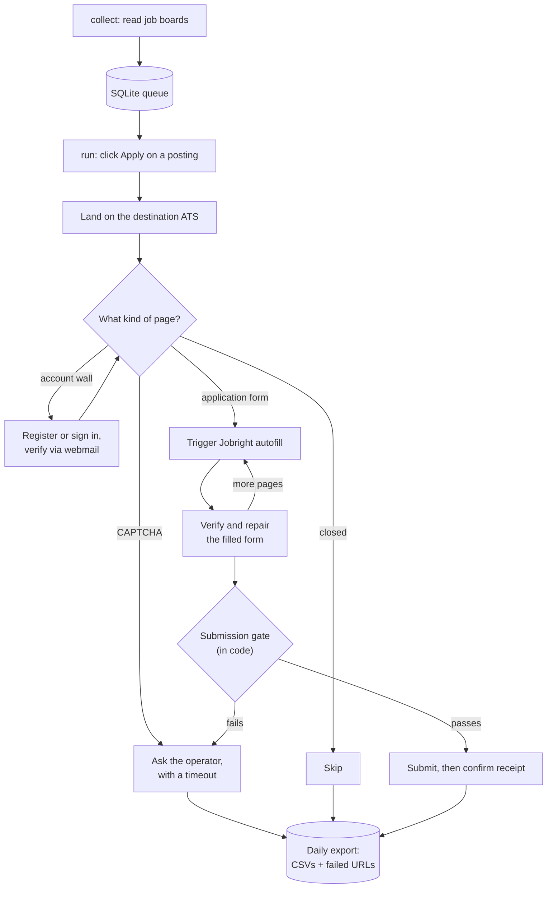

# Auto Job Apply

An agent that applies to jobs for you. It reads your daily recommendations from
Jobright (and optionally LinkedIn, Wellfound and Handshake), clicks Apply,
triggers the Jobright autofill extension on whatever ATS it lands on, checks and
corrects the filled form, then submits. Anything it cannot finish is recorded with
its URL and exported at the end of the day.

There is no job-match scoring here on purpose. Jobright already decides which jobs
are worth applying to; this agent's job is to get the applications submitted.

## How it works



Three design decisions are worth knowing up front, because they shape everything
else:

**It drives your real Chrome profile.** The Jobright extension has to be installed
and signed in for autofill to work, and Chrome removed the flags that let
automation side-load an extension. So the agent uses one dedicated Chrome profile
that you set up once. That profile also holds your logged-in sessions for the job
boards and your mailbox, which is why runs need no authentication step.

**The model never decides to submit.** An OpenAI model checks and repairs the
form, but the decision to click Submit is made in code, and only when the
verifier's verdict *and* an independent check that no required field is empty both
agree. A model can be confidently wrong; the field check cannot.

**It will not invent answers about you.** Everything it enters comes from
`config/profile.yaml` and `config/answers.yaml`. If a required question is not
covered there, the application stops and the question is logged for you to answer,
rather than being filled with something plausible. A blocked application is
recoverable; a fabricated answer in a submitted one is not.

## Setup

Requires Node 22 or newer and Google Chrome.

```bash
npm install
npx playwright install chromium   # only needed to run the test suite
```

### 1. Configure secrets

```bash
cp .env.example .env
```

Fill in:

| Variable | What it is |
| --- | --- |
| `OPENAI_API_KEY` | Your OpenAI key. Used only for form verification. |
| `OPENAI_MODEL` | A vision-capable model; the verifier sends a screenshot. |
| `APPLICATION_EMAIL` | The address used when an ATS forces an account. Must be the mailbox you sign into in the agent's Chrome profile. |
| `VAULT_KEY` | Encryption key for ATS passwords. Generate with `openssl rand -base64 32`. |
| `NOTIFY_WEBHOOK` | Optional Slack or Discord webhook for "needs a human" alerts. |

### 2. Fill in your details

```bash
cp config/profile.example.yaml config/profile.yaml
cp config/answers.example.yaml config/answers.yaml
```

`profile.yaml` is your identity, address, links and education. `answers.yaml` is
the recurring screening questions: work authorization, sponsorship, salary
expectation, per-skill years of experience, EEO responses, and a regex-matched
list for anything else.

Read `answers.yaml` properly rather than accepting the defaults. These answers go
into real applications in your name. Two things in particular:

- **EEO questions** default to the decline-to-answer options. Those are voluntary
  in the US and accepted by every compliant form, but set them to whatever you
  actually want to disclose.
- **`consent.acceptTermsAndPolicies`** controls whether the agent may tick "I
  accept the terms" and "I certify this information is accurate" boxes on your
  behalf. Nearly every application has one and will not submit without it. Set it
  to `false` and those applications get handed to you instead.

Put your resume at `assets/resume.pdf`, or point `assets.resumePath` in
`config/config.yaml` somewhere else.

### 3. Provision the browser profile

```bash
npm run setup:browser
```

This opens a Chrome window on a dedicated profile and walks you through
installing the Jobright extension, signing into it, and signing into the job
boards and your webmail. It then verifies what it can and tells you what is
missing. Run it again any time to re-check.

You only do this once. The profile persists between runs.

## Daily use

```bash
npm run collect      # fill the queue from the enabled boards
npm run run:dry      # fill and verify everything, submit nothing
npm run status       # queue depth, today's counters, what is stuck
npm run export       # write today's CSVs and failed-URL list
```

### Start in dry-run, then graduate

There are three modes, and the safe one is the default:

- `npm run run:dry` — does everything including autofill and verification, but
  never clicks Submit. Screenshots land in `data/artifacts/<date>/` for you to
  audit.
- `npm run run:review` — asks you before each submission.
- `npm run run:auto` — full autonomy.

Run dry a few times and look at the screenshots. When the forms look right, move
to `review` for a day, then `auto`. Skipping straight to `auto` means finding out
about a systematic mistake after fifty applications rather than before one.

### Hitting 50 a day

`daily.target` in `config/config.yaml` is set to 50. The runner spreads work
across `daily.activeWindow` with a randomised gap between applications, and each
source has its own daily cap. LinkedIn's cap is deliberately low.

A single `npm run run:auto` works until the day's budget is met or the queue runs
dry. To make it unattended, run collect and run on a schedule:

```cron
0 8 * * *   cd /path/to/repo && npm run collect
0 9-20 * * * cd /path/to/repo && npm run run:auto
30 21 * * * cd /path/to/repo && npm run export
```

Counters are per calendar day, so re-running never exceeds the target.

### What to do with the export

`data/exports/<date>/` gets four files:

- `applications.csv` — every attempt, submitted or not.
- `failures.csv` — everything that did not complete, with the URL it stopped at,
  the stage, the reason, and a screenshot path.
- `failed-urls.txt` — the same URLs, bare, for pasting into a browser.
- `summary.md` — counts, reasons, and the questions that blocked applications.

The last section of `summary.md` is the one that compounds. Every question listed
there stopped at least one application; adding it to `answers.yaml` stops it
recurring. Expect to spend the first few days feeding the answer bank, after which
the human-intervention rate drops sharply.

## Commands

| Command | Purpose |
| --- | --- |
| `npm run setup:browser` | One-time profile provisioning and sign-in check |
| `npm run collect` | Discover jobs and queue them |
| `npm run run:dry` | Fill and verify without submitting |
| `npm run run:review` | Submit with per-application confirmation |
| `npm run run:auto` | Submit autonomously |
| `npm run status` | Queue, counters, failures, unanswered questions |
| `npm run export` | Write the day's report |
| `npm run vault:export` | Print ATS accounts the agent created, with passwords |
| `npm test` | Test suite (needs a display; use `npm run test:browser`) |

Flags: `--limit <n>`, `--source <name>`, `--date <YYYY-MM-DD>`.

## When something breaks

**"Chrome did not expose the debug port"** — `CHROME_PROFILE_DIR` is pointing at
your default Chrome profile. Chrome 136 and later refuse to open a debugging port
on it. Point it at a dedicated directory such as `./.browser-profile`.

**Autofill is not being triggered** — the extension changed its markup. The
selectors are data, not code: edit `config/jobright-selectors.yaml`. The agent
falls back to filling from your answer bank, so applications still go out, just
slower and with more escalations. Also check the extension is still signed in.

**Collection finds nothing** — a board changed its markup, or the session expired.
Edit `config/sources-selectors.yaml`, and re-run `npm run setup:browser` to check
sign-in state.

**Everything needs a human** — usually an expired board session or an answer bank
that is too thin. `npm run status` shows which questions are blocking.

**The run stopped early** — the circuit breaker trips after
`safety.circuitBreakerFailures` consecutive hard failures, on the assumption that
something systemic is wrong and continuing would waste the day's quota. Check
`data/logs/<date>.jsonl`.

## Things you should know

**Terms of service.** LinkedIn and Handshake prohibit automated access in their
terms. Using this against them risks your account being restricted. The
conservative per-source caps and randomised pacing reduce the footprint but do not
make it sanctioned. Jobright is the source designed to be used this way.

**CAPTCHAs are not defeated here.** When the agent meets one it asks you, and if
you do not answer within `safety.humanWaitSeconds` it records the URL and moves
on. That timeout exists so one challenge at 2am cannot stall the whole day.

**An unconfirmed submission is reported, not assumed.** If the agent clicks Submit
but the resulting page does not confirm receipt, the application is flagged for
you to check rather than counted as done.

**Volume is a trade-off.** Fifty autonomous applications a day is aggressive.
Everything above about dry-run and the answer bank exists so you can confirm
quality before turning up the volume.

## Layout

```
config/    config.yaml, answer bank, and the two selector files
src/
  browser/   Chrome launch, CDP attach, human-like interaction
  jobright/  extension detection and the autofill driver
  sources/   job board adapters
  apply/     orchestrator, extraction, verification, submission, accounts
  llm/       OpenAI client, prompts, response schemas
  mail/      webmail verification reader
  store/     SQLite schema, queue, encrypted credential vault
  export/    daily CSV and summary
data/      database, screenshots, logs, exports (git-ignored)
```
